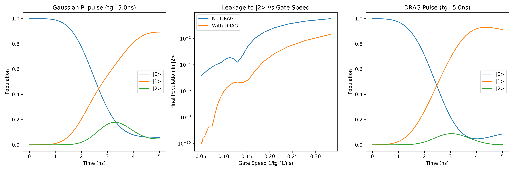

# Mitigating Leakage in Transmon Qubits using DRAG

Welcome to the DRAG simulation project! This directory contains a full numerical simulation of a three-level transmon qubit system using QuTiP. The primary goal is to demonstrate why driving a transmon too fast leads to computational errors, and how we can elegantly fix this using a technique called **Derivative Removal by Adiabatic Gate (DRAG)**.

## The Theory: Why do we need DRAG?

Superconducting transmons are the leading hardware for quantum computers. However, a transmon is not a perfect, ideal two-level qubit. Instead, it is an anharmonic oscillator. This means it has an infinite ladder of energy states ($|0\rangle, |1\rangle, |2\rangle...$), where the energy difference between consecutive levels gets slightly smaller as you go up. 

The difference between the $|0\rangle \rightarrow |1\rangle$ transition frequency and the $|1\rangle \rightarrow |2\rangle$ transition frequency is known as the **anharmonicity** ($\alpha$). For a typical transmon, $\alpha$ is around $-250 \text{ MHz}$ to $-300 \text{ MHz}$.

To run algorithms quickly and beat decoherence, we want to drive our quantum gates as fast as possible. However, the Fourier transform teaches us a harsh truth: a short pulse in the time domain corresponds to a broad signal in the frequency domain. If we use a very short, fast microwave pulse (e.g., $T = 5 \text{ ns}$) to flip the qubit from $|0\rangle$ to $|1\rangle$, the frequency spread of that pulse becomes so wide that it accidentally excites the $|1\rangle \rightarrow |2\rangle$ transition. This loss of information into the $|2\rangle$ state is called **leakage**, and it is fatal for quantum computation.

**The DRAG Solution:**
As outlined in the comprehensive review by Krantz et al. [1] and originally proposed by Motzoi et al. [2], we can suppress this leakage by cleverly shaping our microwave pulse. Instead of just sending a standard Gaussian pulse on the in-phase (X) channel, we simultaneously send a second pulse on the out-of-phase (Y) quadrature. 

The shape of this Y-channel pulse is exactly proportional to the **derivative** of the X-channel pulse. Mathematically, the DRAG correction drive is:

$$ \Omega_Y(t) = -\lambda \frac{\dot{\Omega}_X(t)}{\alpha} $$

where $\lambda$ is a dimensionless scaling parameter (theoretically ideal at $\lambda = 1$). This specific shape creates destructive interference in the frequency domain, perfectly canceling out the unwanted frequency components that cause leakage into $|2\rangle$, allowing us to perform very fast gates with high fidelity.

## Simulation Structure

The code (`drag_simulation.py`) is structured logically to build up the physics step-by-step:

1. **Pulse Definition & Normalization**: We define a Gaussian envelope for our X-channel drive. We use `scipy.integrate.quad` to numerically integrate the envelope, ensuring we scale the amplitude perfectly to achieve a $\pi$-rotation.
2. **System Setup**: We construct the 3-level Hamiltonian in the rotating frame using QuTiP (`Qobj`). We define the static anharmonicity, the in-phase drive ($H_d$), and the quadrature drive ($H_Q$).
3. **Bare Pulse Sweeps**: We simulate the state evolution using `sesolve` across different pulse durations ($T = 50 \text{ ns}$ down to $2 \text{ ns}$) without DRAG, explicitly plotting how faster gates dramatically increase leakage.
4. **DRAG Implementation**: We analytically differentiate our Gaussian pulse to build the DRAG coefficient function and simulate a fast $5 \text{ ns}$ gate.
5. **Parameter Optimization**: We sweep the DRAG parameter $\lambda$ around $1.0$ to experimentally find the absolute minimum leakage for our specific pulse shape.
6. **Final Benchmarking**: We compare the leakage of Bare vs. DRAG pulses across all speeds, demonstrating the massive suppression factor gained by using DRAG.

## Simulation Results

Below is a visual summary of the dynamics when driving the transmon:



As expected from the theory, applying a standard Gaussian pulse at high speeds (e.g., $5 \text{ ns}$) results in significant population ending up in the $|2\rangle$ state. When the DRAG protocol is applied (introducing the derivative-shaped Y-pulse), this leakage is suppressed by orders of magnitude. 

If you run the `drag_simulation.py` script, the final terminal output will calculate the exact **Suppression factor** (how many times smaller the leakage is with DRAG vs without DRAG) across different gate speeds. For a 5ns pulse, DRAG typically reduces leakage by a factor of over 100x!

## How to Run

1. Make sure you have installed the requirements:
   ```bash
   pip install -r requirements.txt
   ```
2. Run the Python script:
   ```bash
   python drag_simulation.py
   ```

## References

1. P. Krantz, M. Kjaergaard, F. Yan, T. P. Orlando, S. Gustavsson, and W. D. Oliver, *"A Quantum Engineer's Guide to Superconducting Qubits"*, Applied Physics Reviews 6, 021318 (2019). [DOI: 10.1063/1.5089550](https://doi.org/10.1063/1.5089550)
2. F. Motzoi, J. M. Gambetta, P. Rebentrost, and F. K. Wilhelm, *"Simple Pulses for Elimination of Leakage in Weakly Nonlinear Qubits"*, Physical Review Letters 103, 110501 (2009). [DOI: 10.1103/PhysRevLett.103.110501](https://doi.org/10.1103/PhysRevLett.103.110501)
